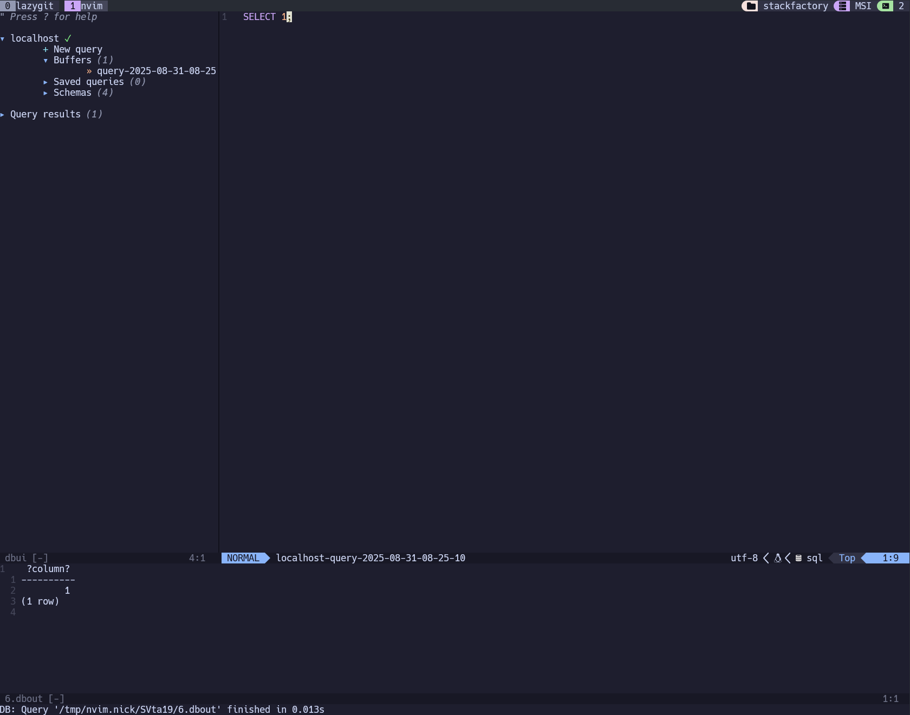
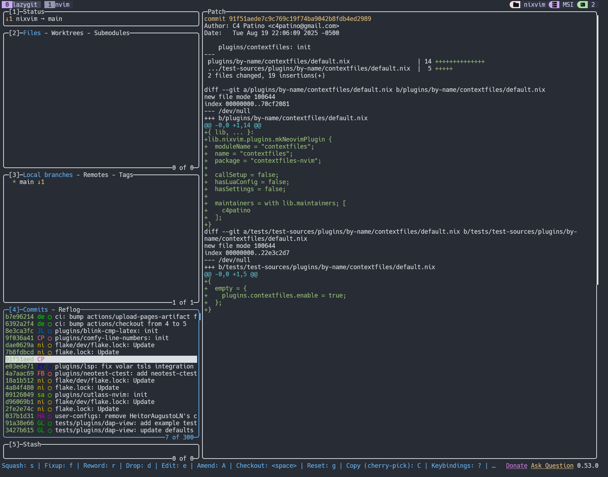

# Dots
My personal dotfiles. Nick'snix, if you will. Not associated with the [delicious, buttery preztel snacks](https://en.wikipedia.org/wiki/Dot%27s_Pretzels), but open to affiliation discussions.

# Show me the goods
Its mostly terminal tools because I use a mix of WSL/Mac and an actual nix machine.

Neovim and tmux (dadbod ui)

Lazygit

You get the idea...

# Special thanks
- Forked from this [repo](https://github.com/Misterio77/nix-starter-configs) (standard version)
